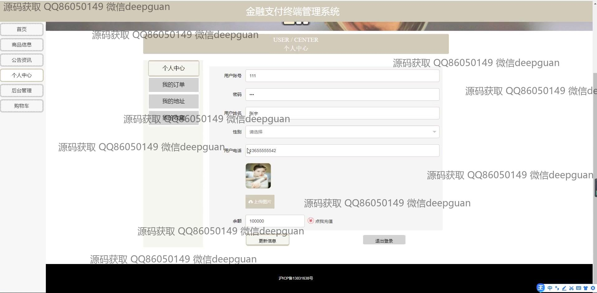

<h1 align="center">基于技术的金融支付终端管理系统设计与实现+jsp</h1>

## 简介
金融支付终端管理系统：角色分为管理员、用户；功能包括用户注册登录、商品信息管理、订单管理、支付管理、个人中心、地址管理、公告资讯等模块，界面设计简洁高效。    --计算机毕业设计源码；毕设源码；java毕业设计源码

## 联系方式

<h3 align="center">获取完整代码与数据库文件 + 微信：deepguan QQ: 86050149 QQ群: 783742310</h3>

<h3 align="center">可帮忙远程部署 包运行成功！提供远程部署、修改代码、设计文档指导、代码讲解等服务！</h3>

## 功能介绍（完整见运行截图）
管理员：基本功能包括登录、注册和退出。系统提供的导航菜单涵盖个人中心、用户管理、商品类别管理、商品信息管理、系统管理和订单管理等模块。管理员可以有效地管理用户信息和商品数据，进行系统设置和订单管理操作，例如查询、查看详情、编辑和删除订单。个人中心展示管理员信息，可以修改个人信息。用户：用户可通过系统界面进行注册、登录和退出等基本操作。系统主页包括商品信息浏览，如商品类别、详细介绍，以及购物车管理和支付选项。用户个人中心提供查看和编辑个人信息、订单查询、收藏夹和地址管理的功能。此外，用户还可以在个人中心更新账户信息，查看订单详情并进行后续操作。

## 运行截图

本代码来源于网络,仅供学习参考使用!

